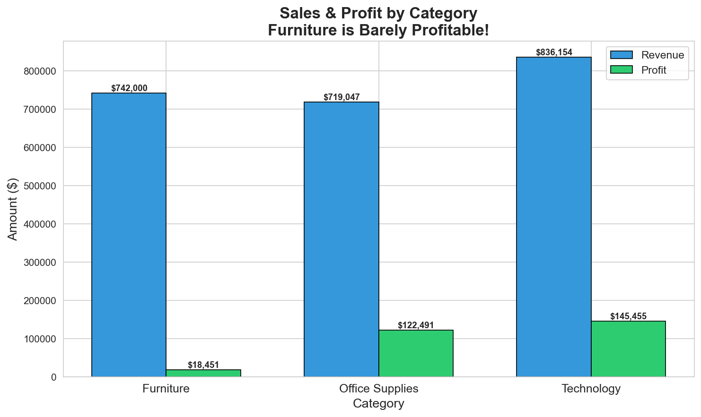
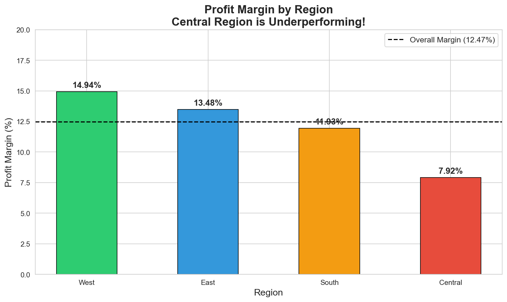
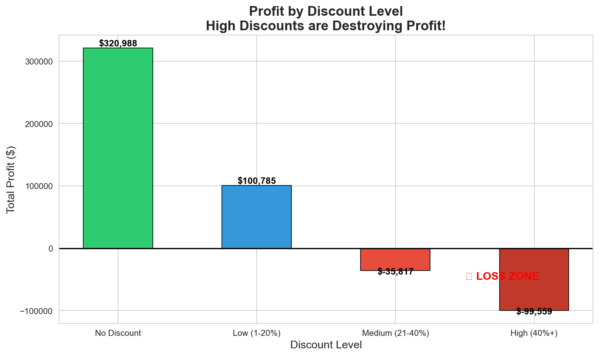
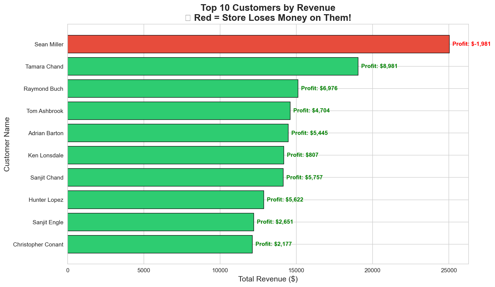
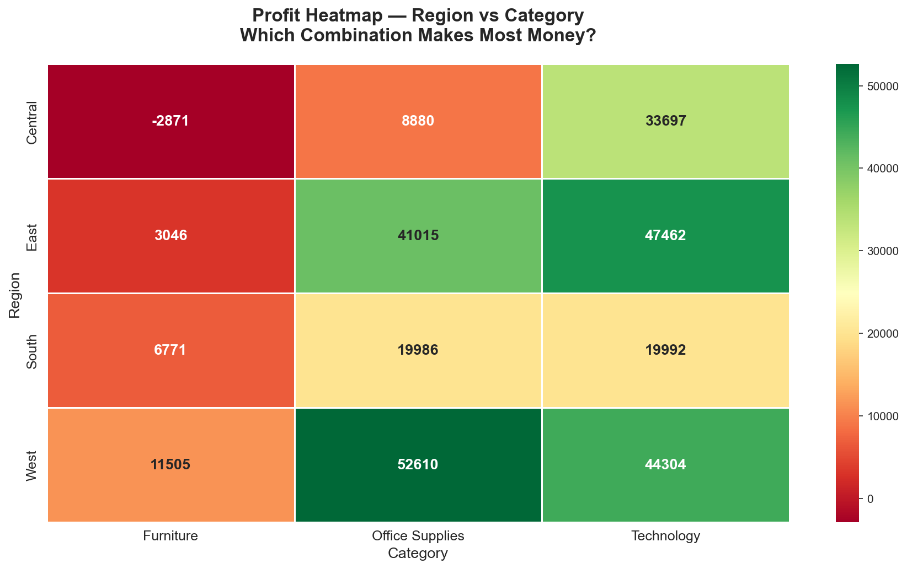

# 🛒 Retail Sales Performance Analysis
### SQL + Python | 9,994 Orders | Business Intelligence Project

---

## 📌 Project Overview
A retail store generating $2.27 Million in revenue but keeping 
only 12.45% profit margin. As a data analyst, I investigated 
WHERE the store is losing money and WHO are the real premium 
customers — using SQL and Python.

---

## 🛠️ Tools Used
- **MySQL** — Data extraction & business queries
- **Python** — Data visualization (Pandas, Matplotlib, Seaborn)
- **Jupyter Notebook** — Analysis environment

---

## 🔑 Key Business Findings

| # | Finding | Insight |
|---|---|---|
| 1 | Overall Performance | $2.27M revenue, only 12.45% profit margin |
| 2 | Category Analysis | 🔴 Furniture only 2.32% margin — almost breaking even! |
| 3 | Region Analysis | 🔴 Central region struggling at only 8.06% margin |
| 4 | Customer Analysis | 🚨 Top revenue customer Sean Miller LOSES $1,980! |
| 5 | Discount Impact | 🔴 40%+ discounts lose 77 cents per dollar! |
| 6 | Biggest Risk | 🚨 Central + Furniture = Biggest loss combination! |
| 7 | Biggest Opportunity | 🟢 West + Office Supplies = Most profitable! |

---

## 📊 Visualizations

### 1️⃣ Sales & Profit by Category

### 2️⃣ Profit Margin by Region

### 3️⃣ Discount Impact on Profit

### 4️⃣ Top 10 Customers

### 5️⃣ Profit Heatmap — Region vs Category

---

## 💡 Business Recommendations

1. **Stop Over-Discounting** — Cap all discounts at 20% maximum.
   Orders with 40%+ discount lose 77 cents per dollar!

2. **Review Furniture Strategy** — Furniture generates good revenue
   but only 2.32% margin. Either reprice or reduce inventory.

3. **Fix Central Region** — Central has lowest margin at 8.06%.
   Investigate pricing and discount patterns there immediately.

4. **Protect Profitable Customers** — Tamara Chand generates 
   $8,964 profit. Reward her with loyalty benefits!

5. **Learn from West Region** — West + Office Supplies is the 
   most profitable combination. Replicate this strategy elsewhere!

---

## 📁 Project Structure
---

## 🙋 About Me
Aspiring Data Analyst passionate about turning raw data
into business insights using SQL and Python.

📧 Connect with me on LinkedIn: [ https://www.linkedin.com/in/rahulsharma-analyst ]
